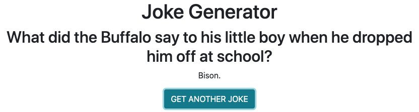

# Joke Generator
This is the first external API, not including Firebase, which I've connected to and specifically gets 10 random jokes which then appear in the app!
### Link to your wireframes/prototype
  [Wireframe](https://www.figma.com/file/dUTnw5fZfWCB2RCRJpS7Af/JJ-Wireframe-JS?node-id=0%3A1)
### Link to the deployed project
  [Deployed Project](https://mg-joke-generator.netlify.app)
### Link to your project board
  [Project Board](https://github.com/GonzalesMatthew/react-joke-generator/projects/1?add_cards_query=is%3Aopen)
### Description of the user
  People who love jokes and want to be mildly entertained with 10 random jokes! Hard refresh for more!
### List of features                                                
  Built with React, connected to external API, joke setup and punchline, button which reveals punchline and also gets a new joke ready.
### Screenshots of your project
Joke setup:

Button reveals punchline and is ready to get a new joke:

Button gets a new joke setup and hides the punchline:

### List of contributors and links to their GH profiles
@GonzalesMatthew
### Link to Loom video walkthrough of your app
[App-Walkthrough Video](https://www.loom.com/share/0472336570c74b1eb3aa2fe38f9da8f5)
